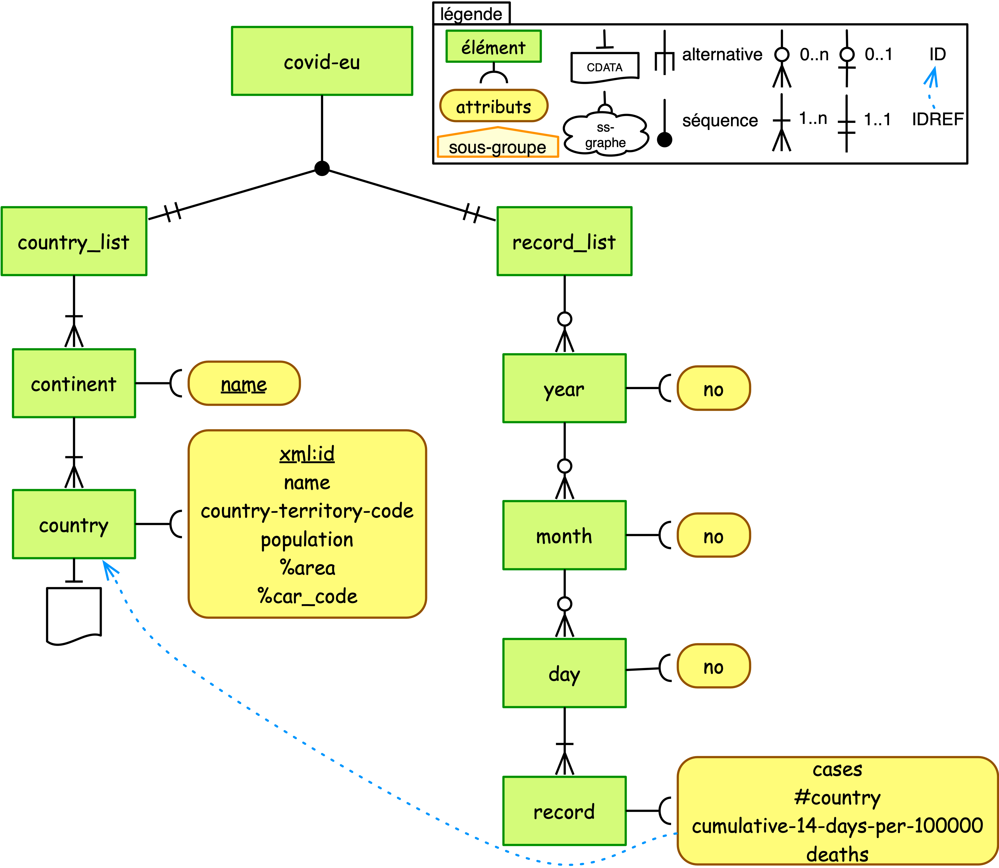

# Covid transformation

## Short presentation

A short process to reorganise the covid file of th EU Open Data site [1] and to enrich it with Mondial database [2] data.


## How to use it ?

Process :
```
source transform.sh EU-Covid-file.xml tagert-file.xml
```

For exemple :

```
source transform.sh ./test/covid19-eu-world-2020-11-11.xml covid-tp.xml
```

The result schema (using [3]) is :



## Links

[1] Covid data in UE : https://data.europa.eu/euodp/en/data/dataset/covid-19-coronavirus-data

[2] Mondial Database : http://www.dbis.informatik.uni-goettingen.de/Mondial/ 

[3] Emmanuel Desmontils. Une représentation graphique des schémas XML pour l'enseignement. Informatique des organisations et systèmes d'informations de décision (INFORSID), INFORSID, May 2014, Lyon, France. pp.279-294. ⟨hal-00995270 : https://hal.archives-ouvertes.fr/hal-00995270⟩

(c) E. Desmontils, University of Nantes, november 2020
